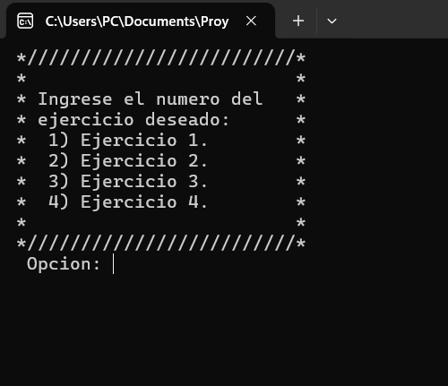

# Condicionales 3 + `%`.

**Ejercicio 1**

Escribe un programa en C++ que solicite al usuario ingresar dos números enteros. El programa debe calcular y mostrar el resultado de la división entera entre ambos números, así como también el módulo o residuo de esa división (usando el operador %).

<video src="Videos/video1.mp4" controls=""></video>

**Ejercicio 2**

Realiza un programa en C++ que lea un número entero ingresado por el usuario y determine si dicho número es par o impar.

<video src="Videos/video2.mp4" controls=""> </video>

**Ejercicio 3**

Escribe un programa en C++ que lea un número decimal pequeño (de 0 a 15) e imprima su representación binaria de 4 bits.
El programa debe realizar divisiones sucesivas entre 2 y almacenar el resto de cada división en variables individuales. Luego debe mostrar la secuencia de bits de forma correcta 

<video src="Videos/video3.mp4" controls=""> </video>

**Ejercicio 4**

Crea un programa en C++ que muestre un menú con las siguientes opciones: 1) Ejercicio 1, 2) Ejercicio 2, 3) Ejercicio 3, 4) Ejercicio 4. El programa debe permitir al usuario elegir una opción y ejecutar el ejercicio correspondiente. Para cada opción, el programa debe pedir los datos necesarios y mostrar el resultado de la operación solicitada. 

*Ejemplo del menu:*

